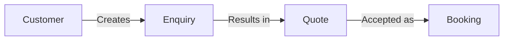
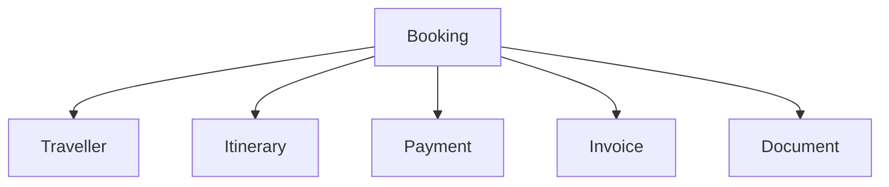
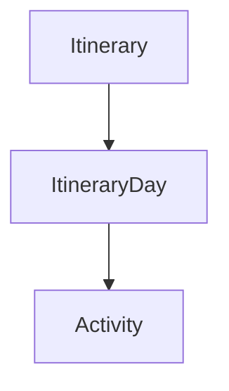
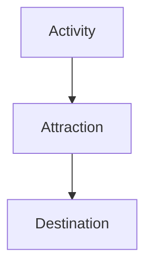
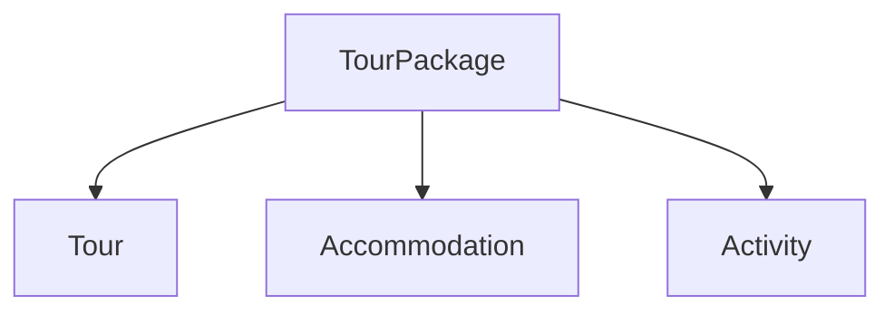
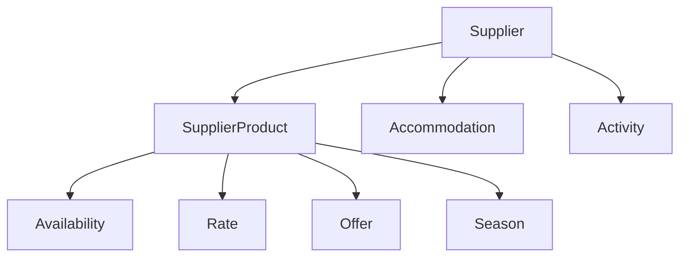
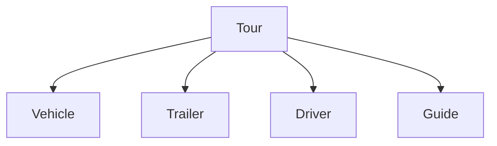
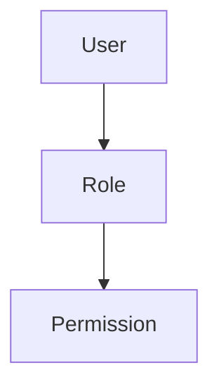

# BUS-002 – Business Entity Model

| **Document ID** | BUS-002 |
|-----------------|---------|
| **Version** | 1.0.0 |
| **Status** | Draft |
| **Owner** | Business Architecture |
| **Author** | Go Cape Tours |
| **Last Updated** | 2026-07-22 |

---

# 1. Purpose

This specification defines the Business Entity Model for the Go Cape Tours platform.

Business entities represent the core business concepts that Go Cape Tours manages throughout its operations.

The Business Entity Model establishes a common business vocabulary that is shared across Business Architecture, Engineering and Implementation.

This specification is implementation independent and does not define database schemas, APIs or software classes.

---

# 2. Scope

This specification defines:

- Business Entities
- Entity Ownership
- Business Relationships
- Business Rules

This specification does not define:

- Database Design
- Entity Attributes
- API Contracts
- User Interface Design

These are addressed by the Engineering Specifications.

---

# 3. Business Entity Principles

## BEP-001 Business First

Business Entities represent business concepts rather than technical structures.

---

## BEP-002 Implementation Independent

The Business Entity Model shall remain independent of implementation technology.

---

## BEP-003 Single Responsibility

Each Business Entity shall represent a single business concept.

---

## BEP-004 Capability Ownership

Every Business Entity shall be owned by a Business Capability.

---

## BEP-005 Shared Vocabulary

Business Entities establish the common language used throughout the platform.

---

# 4. Business Entity Catalogue

## 4.1 Commercial

| ID | Entity | Capability Owner |
|----|--------|------------------|
| ENT-001 | Customer | BC-001 Customer Management |
| ENT-002 | Traveller | BC-003 Booking Management |
| ENT-003 | Enquiry | BC-001 Customer Management |
| ENT-004 | Quote | BC-004 Pricing & Quotations |
| ENT-005 | Booking | BC-003 Booking Management |

---

## 4.2 Products & Services

| ID | Entity | Capability Owner |
|----|--------|------------------|
| ENT-006 | Tour | BC-006 Tour Management |
| ENT-007 | Tour Package | BC-006 Tour Management |
| ENT-008 | Activity | BC-006 Tour Management |
| ENT-009 | Accommodation | BC-005 Accommodation Management |
| ENT-010 | Destination | BC-006 Tour Management |
| ENT-011 | Attraction | BC-006 Tour Management |

---

## 4.3 Itinerary

| ID | Entity | Capability Owner |
|----|--------|------------------|
| ENT-012 | Itinerary | BC-009 Itinerary Management |
| ENT-013 | Itinerary Day | BC-009 Itinerary Management |
| ENT-014 | Itinerary Item | BC-009 Itinerary Management |

---

## 4.4 Suppliers

| ID | Entity | Capability Owner |
|----|--------|------------------|
| ENT-015 | Supplier | BC-007 Supplier Management |
| ENT-016 | Supplier Product | BC-007 Supplier Management |
| ENT-017 | Supplier Agreement | BC-007 Supplier Management |

---

## 4.5 Availability & Pricing

| ID | Entity | Capability Owner |
|----|--------|------------------|
| ENT-018 | Availability | BC-008 Availability Management |
| ENT-019 | Rate | BC-004 Pricing & Quotations |
| ENT-020 | Offer | BC-004 Pricing & Quotations |
| ENT-021 | Season | BC-004 Pricing & Quotations |
| ENT-022 | Currency | BC-010 Payment Management |

---

## 4.6 Financial

| ID | Entity | Capability Owner |
|----|--------|------------------|
| ENT-023 | Payment | BC-010 Payment Management |
| ENT-024 | Invoice | BC-011 Invoicing & Refunds |
| ENT-025 | Refund | BC-011 Invoicing & Refunds |
| ENT-026 | Commission | BC-011 Invoicing & Refunds |
| ENT-027 | Tax | BC-011 Invoicing & Refunds |

---

## 4.7 Operations

| ID | Entity | Capability Owner |
|----|--------|------------------|
| ENT-028 | Vehicle | BC-006 Tour Management |
| ENT-029 | Trailer | BC-006 Tour Management |
| ENT-030 | Guide | BC-006 Tour Management |
| ENT-031 | Driver | BC-006 Tour Management |
| ENT-032 | Pickup Location | BC-003 Booking Management |
| ENT-033 | Meeting Point | BC-006 Tour Management |

---

## 4.8 Platform

| ID | Entity | Capability Owner |
|----|--------|------------------|
| ENT-034 | User | BC-015 Security & Identity |
| ENT-035 | Role | BC-015 Security & Identity |
| ENT-036 | Permission | BC-015 Security & Identity |
| ENT-037 | Notification | BC-018 Notifications |
| ENT-038 | Document | BC-013 Document Management |
| ENT-039 | Media Asset | BC-013 Document Management |

---

# 5. Business Relationship Model

## Commercial Lifecycle

---

## Booking

---

## Itinerary

---

## Tourism

---

## Products

---

## Suppliers

---

## Operations

---

## Security

---

# 6. Business Relationship Rules

- A Customer may create multiple Enquiries.
- An Enquiry may result in one or more Quotes.
- A Quote may be accepted as a single Booking.
- A Booking shall contain one or more Travellers.
- A Booking references a single Itinerary.
- An Itinerary contains one or more Itinerary Days.
- An Itinerary Day contains one or more Activities.
- An Activity occurs at a single Attraction.
- An Attraction belongs to a Destination.
- A Tour Package may include Tours, Accommodation and Activities.
- A Supplier may provide multiple Supplier Products.
- A Tour may be assigned a Driver, a Guide or both.
- A Trailer is assigned only when operationally required.

---

# 7. References

- BUS-000 Business Architecture Specification Standard
- BUS-001 Business Capability Model
- BUS-003 Business Process Model (Future)
