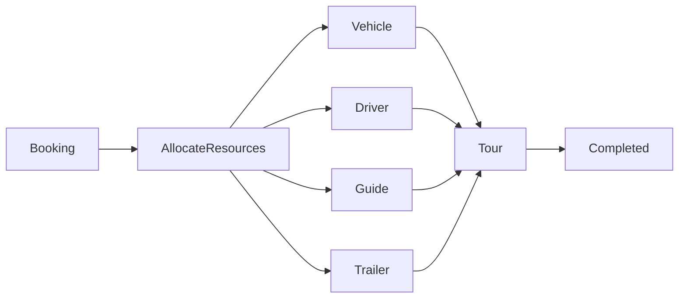

# BUS-003 – Business Process Model

| **Document ID** | BUS-003 |
|-----------------|---------|
| **Version** | 1.0.0 |
| **Status** | Draft |
| **Owner** | Business Architecture |
| **Author** | Go Cape Tours |
| **Last Updated** | 2026-07-22 |

---

# 1. Purpose

This specification defines the Business Process Model for the Go Cape Tours platform.

Business Processes describe how Business Capabilities and Business Entities interact to deliver products and services to customers.

The Business Process Model provides the operational view of the business and establishes the foundation for engineering design and implementation.

This specification is implementation independent and does not define workflows, APIs or software components.

---

# 2. Scope

This specification defines:

- Core Business Processes
- Process Ownership
- Business Process Relationships
- Business Process Principles

This specification does not define:

- Technical Workflows
- Application Logic
- User Interfaces
- Database Transactions

These are defined within the Engineering Specifications.

---

# 3. Business Process Principles

## BPP-001 Value Driven

Every Business Process shall deliver measurable business value.

---

## BPP-002 Capability Owned

Every Business Process shall be owned by a single Business Capability.

---

## BPP-003 Entity Driven

Business Processes operate on Business Entities defined in BUS-002.

---

## BPP-004 Implementation Independent

Business Processes describe business operations rather than technical implementation.

---

## BPP-005 End-to-End

Processes should model complete business outcomes rather than individual tasks.

---

# 4. Business Process Catalogue

## Customer & Sales

| ID | Process | Capability Owner |
|----|---------|------------------|
| PRC-001 | Manage Customer | BC-001 Customer Management |
| PRC-002 | Manage Enquiry | BC-001 Customer Management |
| PRC-003 | Prepare Quote | BC-004 Pricing & Quotations |
| PRC-004 | Confirm Booking | BC-003 Booking Management |

---

## Product Management

| ID | Process | Capability Owner |
|----|---------|------------------|
| PRC-005 | Manage Tours | BC-006 Tour Management |
| PRC-006 | Manage Tour Packages | BC-006 Tour Management |
| PRC-007 | Manage Activities | BC-006 Tour Management |
| PRC-008 | Manage Accommodation | BC-005 Accommodation Management |

---

## Itinerary

| ID | Process | Capability Owner |
|----|---------|------------------|
| PRC-009 | Build Itinerary | BC-009 Itinerary Management |
| PRC-010 | Manage Itinerary | BC-009 Itinerary Management |

---

## Supplier Management

| ID | Process | Capability Owner |
|----|---------|------------------|
| PRC-011 | Manage Suppliers | BC-007 Supplier Management |
| PRC-012 | Synchronise Supplier Products | BC-007 Supplier Management |
| PRC-013 | Synchronise Availability & Rates | BC-008 Availability Management |

---

## Operations

| ID | Process | Capability Owner |
|----|---------|------------------|
| PRC-014 | Allocate Operational Resources | BC-006 Tour Management |
| PRC-015 | Deliver Tour | BC-006 Tour Management |

---

## Financial

| ID | Process | Capability Owner |
|----|---------|------------------|
| PRC-016 | Receive Payment | BC-010 Payment Management |
| PRC-017 | Produce Invoice | BC-011 Invoicing & Refunds |
| PRC-018 | Process Refund | BC-011 Invoicing & Refunds |

---

## Platform

| ID | Process | Capability Owner |
|----|---------|------------------|
| PRC-019 | Manage Users | BC-015 Security & Identity |
| PRC-020 | Send Notifications | BC-018 Notifications |

---

# 5. Core Business Process

## Customer Booking Journey

---

## Supplier Synchronisation

---

## Tour Delivery

---

# 6. Business Process Rules

- Every Booking originates from an accepted Quote.
- Every Booking shall contain at least one Traveller.
- Every Booking shall have an Itinerary.
- Supplier availability shall be synchronised before confirming supplier services.
- Payments shall be recorded before final confirmation where applicable.
- Tours shall only be delivered once operational resources have been allocated.
- A Tour may require a Driver, a Guide, or both.
- A Trailer is allocated only when operationally required.

---

# 7. References

- BUS-000 Business Architecture Specification Standard
- BUS-001 Business Capability Model
- BUS-002 Business Entity Model
