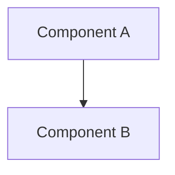

# ARCH-XXX – [Architecture Document Title]

> **[Architecture Classification]**
>
> [Concise statement describing the architectural purpose of this document.]
>
> This document SHALL conform to ARCH-000 – Architecture Manifest.

---

## Document Control

| Property | Value |
|---|---|
| Architecture ID | ARCH-XXX |
| Title | [Title] |
| Version | 0.1.0 |
| Status | Draft |
| Classification | [Architecture Classification] |
| Owner | Platform Architecture |
| Applies To | [Platform / Project / Shared] |
| Parent Authority | ARCH-000 – Architecture Manifest |

---

## Revision History

| Version | Date | Description | Author |
|---|---|---|---|
| 0.1.0 | YYYY-MM-DD | Initial draft | [Author / Owner] |

---

## Table of Contents

1. Purpose
2. Scope
3. Architecture Context
4. Architectural Drivers
5. Architectural Principles
6. Architecture Definition
7. Boundaries and Responsibilities
8. Dependencies and Interactions
9. Data and Ownership
10. Security Considerations
11. Integration Considerations
12. Operational Considerations
13. Constraints
14. Risks and Trade-offs
15. Related Architecture
16. Related Specifications
17. Related ADRs
18. Compliance
19. Change Control
20. Approval

---

# 1. Purpose

[Define why this architecture document exists.]

---

# 2. Scope

## In Scope

- [Item]

## Out of Scope

- [Item]

---

# 3. Architecture Context

[Describe the architectural context and where this subject fits within the wider platform.]

---

# 4. Architectural Drivers

Document the primary drivers influencing this architecture.

Examples:

- business capability;
- maintainability;
- scalability;
- security;
- provider independence;
- regulatory requirements.

---

# 5. Architectural Principles

[Identify the relevant principles inherited from ARCH-000 and any subject-specific principles.]

This document SHALL NOT contradict ARCH-000.

---

# 6. Architecture Definition

[Define the architecture.]

Where useful, include Mermaid diagrams.

Written requirements remain authoritative where a diagram is ambiguous.

---

# 7. Boundaries and Responsibilities

[Define architectural boundaries and ownership.]

---

# 8. Dependencies and Interactions

[Define allowed dependencies, interactions, and dependency direction.]

---

# 9. Data and Ownership

[Define relevant data ownership and canonical-model considerations.]

---

# 10. Security Considerations

[Define architectural security concerns or reference the appropriate security architecture.]

---

# 11. Integration Considerations

[Define external boundaries, provider independence, adapters, and anti-corruption requirements where applicable.]

---

# 12. Operational Considerations

[Define relevant reliability, observability, scalability, and operational concerns.]

---

# 13. Constraints

- [Constraint]

---

# 14. Risks and Trade-offs

| Risk / Trade-off | Impact | Mitigation / Rationale |
|---|---|---|
| [Item] | [Impact] | [Response] |

---

# 15. Related Architecture

- ARCH-000 – Architecture Manifest
- [Related ARCH documents]

---

# 16. Related Specifications

- [Related SPEC documents]

---

# 17. Related ADRs

- [Related ADRs or `None`]

---

# 18. Compliance

This architecture SHALL:

- conform to ARCH-000;
- remain consistent with higher-authority governance;
- preserve approved domain and architectural boundaries;
- be reflected accurately in dependent specifications.

---

# 19. Change Control

Material changes SHALL undergo appropriate architectural review.

Where a change affects specifications or ADRs, those artefacts SHALL be reconciled before dependent implementation proceeds.

---

# 20. Approval

## Approval Status

**[DRAFT / APPROVED]**

## Baseline

**[Document Title] v[Version]**

## Governing Authority

ARCH-000 – Architecture Manifest

---

**End of ARCH-XXX – [Architecture Document Title]**